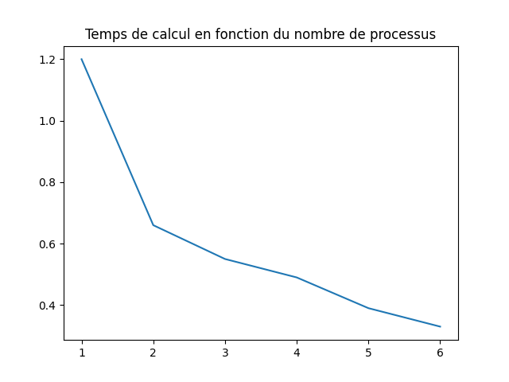
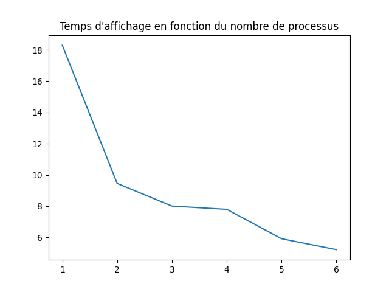

## Introduction

A l'aide de la commande lscpu, ma machine m'informe qu'elle possède 6 coeurs physiques, et 12 coeurs logiques (elle fait de l'hyperthreading).
Pour ce qui est des caches L2 et L3, ils sont de 1.5MiB et 12MiB respectivement.

## Automate cellulaire 1D

Pour paralléliser le code, j'ai décidé d'appliquer la stratégie des buckets afni de répartir le calcul de manière égale sur tous mes processus.
Ainsi, je divise le nombre de configurations à tester par le nombre de processus, et je demande à chaque processus de rang k de traiter les
configurations k* (n_config/n_processus) à (k+1) * (n_config/n_processus) -1.

Alors, pour mesurer la vitesse d'exécution de mon programme, sur chaque processus je mesure localement le temps de computation et de display, 
puis je reduce dans le processus de rang 0 avec pour opération MPI.MAX car c'est le processus le plus lent qui donne le temps d'exécution total
du programme.

Résultats de test pour save_as_md activé et save_as_png désactivé : 

|Coeurs                      |   1  |   2   |  3   |   4   |   5   |  6   |
|Temps de calcul  (en s)     |  1.2 | 0.66  | 0.55 | 0.49  | 0.39  | 0.33 |
|Temps de génération (en s)  | 18.3 | 9.46  | 8.01 | 7.80  | 5.92  | 5.22 |

